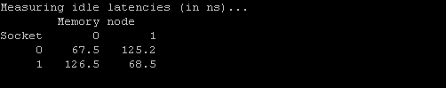
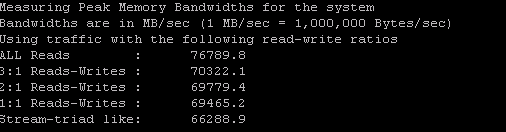
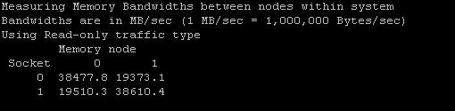
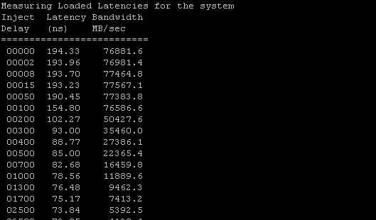

= MEM-bench
:sectnums:
:toc: left

https://software.intel.com/en-us/articles/intelr-memory-latency-checker

== Introduction

An important factor in determining application performance is the time required for the application to fetch data from the processor’s cache hierarchy and from the memory subsystem. In a multi-socket system where Non-Uniform Memory Access (NUMA) is enabled, local memory latencies and cross-socket memory latencies will vary significantly. Besides latency, bandwidth (b/w) also plays a big role in determining performance. So, measuring these latencies and b/w is important to establish a baseline for the system under test, and for performance analysis.

Intel® Memory Latency Checker (Intel® MLC) is a tool used to measure memory latencies and b/w, and how they change with increasing load on the system. It also provides several options for more fine-grained investigation where b/w and latencies from a specific set of cores to caches or memory can be measured as well.

== Installation

Intel® MLC supports both Linux and Windows.

=== Linux

Copy the mlc binary to any directory on your system
Intel® MLC dynamically links to GNU C library (glibc/lpthread) and this library must be present on the system
Root privileges are required to run this tool as the tool modifies the H/W prefetch control MSR to enable/disable prefetchers for latency and b/w measurements. Refer readme documentation on running without root privileges
MSR driver (not part of the install package) should be loaded. This can typically be done with 'modprobe msr' command if it is not already included.

=== Windows

Copy mlc.exe and mlcdrv.sys driver to the same directory. The mlcdrv.sys driver is used to modify the h/w prefetcher settings
There are two sets of binaries (mlc and mlc_avx512). One is compiled with newer tool chain to support Intel® AVX-512 instructions. The other binary supports SSE2 and AVX2 instructions. mlc_avx512 binary is a super set of mlc binary in that it supports SSE2/AVX2 as well. So, mlc_avx512 can be run on processors without support for AVX-512 also. By default AVX-512 instructions won’t be used whether the processor supports it or not unless –Z argument is specified. We recommend you start with mlc_avx512 and if your system does not have the newer versions of glibc, then you can fall back to mlc binary

== HW Prefetcher Control

It is challenging to accurately measure memory latencies on modern Intel processors as they have sophisticated h/w prefetchers. Intel® MLC automatically disables these prefetchers while measuring the latencies and restores them to their previous state on completion. The https://software.intel.com/en-us/articles/disclosure-of-hw-prefetcher-control-on-some-intel-processors[refetcher control] is exposed through MSR and MSR access requires root level permission. So, Intel® MLC needs to be run as ‘root’ on Linux. On Windows, we have provided a signed driver that is used for this MSR access. If Intel® MLC can’t be run with root permissions, please consult the readme.pdf that can be found in the download package.

== What does the tool measure

When the tool is launched without any argument, it automatically identifies the system topology and measures the following four types of information. A screen shot is shown for each.

. A matrix of idle memory latencies for requests originating from each of the sockets and addressed to each of the available sockets. +

. Peak memory b/w measured (assuming all accesses are to local memory) for requests with varying amounts of reads and writes. +

. A matrix of memory b/w values for requests originating from each of the sockets and addressed to each of the available sockets. +

. Latencies at different b/w points. +

It also measures cache-to-cache data transfer latencies

Intel® MLC also provides command line arguments for fine grained control over latencies and b/w that are measured.

Here are some of the things that are possible with command line arguments:

* Measure latencies for requests addressed to a specific memory controller from a specific core

* Measure cache latencies

* Measure b/w from a subset of the cores/sockets

* Measure b/w for different read/write ratios

* Measure latencies for random address patterns instead of sequential

* Change stride size for latency measurements

* Measure cache-to-cache data transfer latencies

== Command line arguments

Launching Intel® MLC without any parameters measures several things as stated earlier. However, with command line arguments, each of the following specific actions can be performed in sequence:

mlc --latency_matrix::

      prints a matrix of local and cross-socket memory latencies

mlc --bandwidth_matrix::

      prints a matrix of local and cross-socket memory b/w

mlc --peak_bandwidth::

      prints peak memory b/w for various read-write ratios with all local accesses

mlc --idle_latency::      

      prints the idle memory latency of the platform

mlc --loaded_latency::        

      prints the loaded memory latency of the platform

mlc --c2c_latency::

      prints the cache-to-cache transfer latencies of the platform

mlc -e::

     do not modify prefetcher settings

There are more options for each of the commands above. Those are documented in the readme file in more detail and can be downloaded.

== Download

Both Linux and Windows versions of  Intel® MLC are included in the download:

* https://software.intel.com/protected-download/494224/493768[Download]